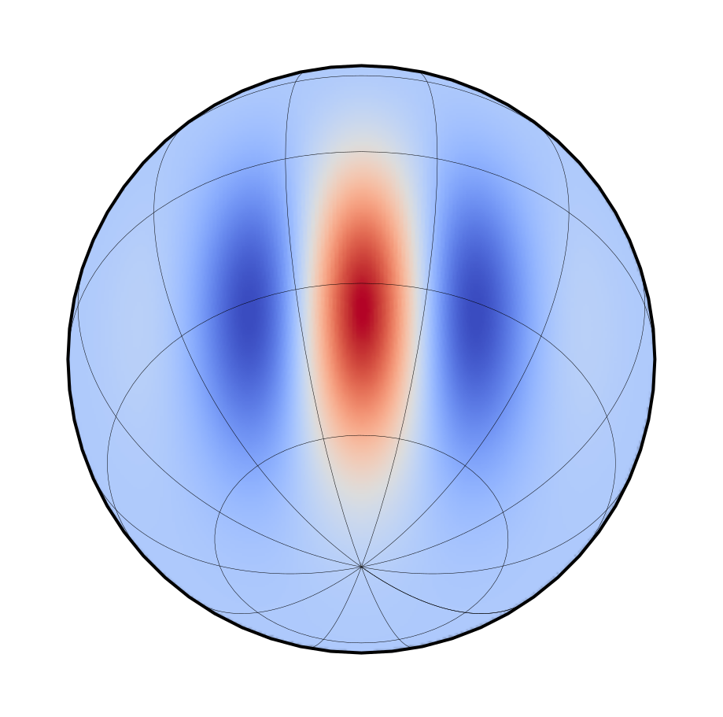

.. _spherical-inr-doc:

Spherical INR
=============

A PyTorch library for building **Implicit Neural Representations** on spherical and 3D domains.

**Features**:

- **Positional Encodings**: Herglotz, Fourier, Spherical & Solid Harmonics  
- **INR Wrappers**: `INR`, `HerglotzNet`, `SirenNet`, and spherical variants  
- **Transforms**: Cartesian ↔ Spherical ↔ Polar  
- **MLP backbones**: Standard & Sine-activated (`SineMLP`)  
- **Losses & Differentiation** utilities  

Getting Started
---------------

Install from PyPI:

.. code-block:: bash

   pip install spherical-inr

Or for development:

.. code-block:: bash

   git clone https://github.com/your-org/spherical-inr.git
   cd spherical-inr
   pip install -e .

Quick Example
~~~~~~~~~~~~~

.. code-block:: python

    import torch
    from spherical_inr import SphericalSirenNet, tp_to_r3

    # build a spherical SIREN: L=3 harmonics, two hidden layers of size 64, output dim=1
    net = SphericalSirenNet(L=3, mlp_sizes=[64,64], output_dim=1, seed=0)

    # sample some θ,ϕ in radians
    coords = torch.rand(8,2) * torch.tensor([3.1416, 6.2832])
    y = net(coords)  # forward on sphere

API Reference
-------------

.. toctree::
   :maxdepth: 2
   :caption: Core Modules

   modules/transform
   modules/positional_encoding
   modules/mlp
   modules/inr
   modules/loss
   modules/differentiation

